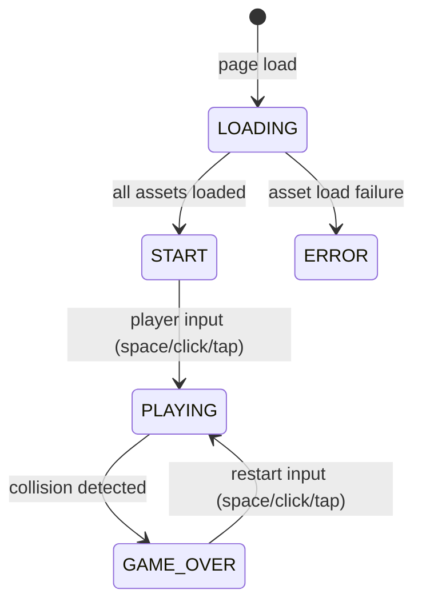

# Design Document: Flappy Kiro

## Overview

Flappy Kiro is a single-file, browser-based endless scroller game built with vanilla HTML5, CSS, and JavaScript. The player controls Ghosty, a ghost sprite, through scrolling pipe obstacles by tapping/clicking/pressing spacebar to flap upward against gravity. The game uses an HTML5 Canvas for all rendering and runs a fixed-timestep game loop via `requestAnimationFrame`.

The entire game ships as one `index.html` file with inline `<style>` and `<script>` blocks. No build tools, bundlers, or external dependencies are required.

### Key Design Decisions

- **Single-file delivery**: All logic, styles, and markup live in `index.html`. Assets are loaded at runtime from the `assets/` directory.
- **Canvas-only rendering**: All game visuals (background, clouds, pipes, Ghosty, UI overlays) are drawn each frame onto a single `<canvas>` element. No DOM elements are used for in-game UI except the canvas itself.
- **Fixed logical resolution with CSS scaling**: The canvas is fixed at 480×640 px internally. CSS `transform: scale()` or `object-fit` keeps it centered and proportional in any viewport.
- **requestAnimationFrame game loop**: A single `gameLoop(timestamp)` function drives physics updates and rendering. Delta-time capping prevents spiral-of-death on tab-blur.
- **Web Audio API for sound**: `AudioContext` is used to play `jump.wav` and `game_over.wav` with low latency. Background music is an `<audio>` element set to `loop`.

---

## Architecture

The game is structured as a set of plain JavaScript objects and functions within a single `<script>` block. There are no classes or modules — state is held in plain objects and arrays, and behavior is implemented as functions that mutate that state. All tunable parameters are read from the single `CONFIG` object at the top of the script; no game logic function uses magic numbers directly.

```
index.html
├── <style>          — canvas centering, body background
├── <canvas id="gameCanvas">
└── <script>
    ├── Asset Loading  — Image + AudioBuffer preloading, error handling
    ├── State          — gameState object, entity arrays
    ├── Input          — keydown / click / touchstart handlers
    ├── Physics        — applyGravity, applyFlap, updatePositions
    ├── Spawning       — spawnPipe, spawnCloud, spawnParticle, spawnScorePopup
    ├── Collision      — checkCollisions (AABB)
    ├── Scoring        — checkScoring, updateHighScore, localStorage I/O
    ├── Rendering      — drawBackground, drawClouds, drawPipes, drawGhosty,
    │                    drawParticles, drawScorePopups, drawScoreBar,
    │                    drawStartScreen, drawGameOverScreen
    ├── Screen Shake   — shakeState, applyShake, updateShake
    └── Game Loop      — gameLoop(timestamp), startGame, restartGame
```

### State Machine



---

## Components and Interfaces

### Game Loop

```
gameLoop(timestamp: DOMHighResTimeStamp) → void
```

Called by `requestAnimationFrame`. Computes `deltaTime` (capped at 100 ms), then:
1. Updates physics (gravity, velocity, position)
2. Updates spawners (pipes, clouds, particles, score popups)
3. Checks collisions and scoring
4. Updates screen shake
5. Clears canvas, applies shake offset, renders all layers in order
6. Schedules next frame

### Input Handler

Listens for `keydown` (spacebar), `click`, and `touchstart` on the canvas. Dispatches to:
- `handleFlap()` — when `gameState.phase === 'PLAYING'`
- `handleStart()` — when `gameState.phase === 'START'`
- `handleRestart()` — when `gameState.phase === 'GAME_OVER'`

### Asset Loader

```
loadAssets() → Promise<void>
```

Loads `ghostyImage` (HTMLImageElement), `jumpBuffer` (AudioBuffer), and `gameOverBuffer` (AudioBuffer) in parallel. On any failure, sets `gameState.phase = 'ERROR'` and renders an error message to the canvas.

Background music is an `<audio id="bgMusic" src="assets/bg_music.ogg" loop>` element. Volume is set to 0.4 to sit below sound effects.

> **Required asset**: `assets/bg_music.ogg` (or `.mp3`) — a looping background music track must be added to the `assets/` directory before the game is complete.

> **Required asset**: `assets/score.wav` — a short score sound effect to play on pipe pass (optional enhancement, noted in Requirement 9.8 context).

### Rendering Pipeline (draw order per frame)

1. `drawBackground()` — solid light-blue fill + sketchy grid/texture lines
2. `drawClouds(clouds)` — far → mid → near layers (painter's algorithm)
3. `drawPipes(pipes)` — green rectangular segments with sketchy border
4. `drawParticles(particles)` — semi-transparent trailing particles behind Ghosty
5. `drawGhosty(ghosty)` — rotated sprite from `assets/ghosty.png`
6. `drawScorePopups(popups)` — floating "+1" text
7. `drawScoreBar(score, highScore)` — bottom bar overlay
8. `drawStartScreen()` / `drawGameOverScreen()` — full-canvas overlays (when applicable)

---

## Data Models

### gameState

```js
const gameState = {
  phase: 'LOADING',   // 'LOADING' | 'START' | 'PLAYING' | 'GAME_OVER' | 'ERROR'
  score: 0,
  highScore: 0,       // loaded from localStorage on init
  lastTimestamp: 0,
};
```

### ghosty

```js
const ghosty = {
  x: 80,              // fixed horizontal position
  y: 320,             // vertical position (px from top)
  vy: 0,              // vertical velocity (px/frame at 60fps equivalent)
  width: 40,
  height: 40,
  rotation: 0,        // radians, derived from vy for rendering
};
```

### Pipe

```js
// Entry in pipes[] array
{
  x: 480,             // left edge of pipe (px)
  gapY: Number,       // top of gap (px from top of canvas)
  gapHeight: 140,     // fixed gap height (px)
  width: 52,
  scored: false,      // true once Ghosty has passed this pipe
}
```

### Cloud

```js
// Entry in clouds[] array
{
  x: Number,
  y: Number,
  width: Number,      // randomized width
  height: Number,     // randomized height
  layer: 0 | 1 | 2,  // 0=far, 1=mid, 2=near
  // scroll speed and opacity derived from layer:
  // layer 0: speed=0.3, opacity=0.15
  // layer 1: speed=0.6, opacity=0.25
  // layer 2: speed=1.0, opacity=0.40
}
```

### Particle

```js
// Entry in particles[] array
{
  x: Number,
  y: Number,
  vx: Number,         // negative (moves left/backward)
  vy: Number,         // small random vertical drift
  opacity: Number,    // starts at 0.7, decreases each tick
  size: Number,       // radius in px
}
```

### ScorePopup

```js
// Entry in scorePopups[] array
{
  x: Number,          // horizontal center of scored pipe gap
  y: Number,          // vertical center of scored pipe gap
  opacity: Number,    // starts at 1.0
  vy: -1.5,           // moves upward
  age: 0,             // ms elapsed
  maxAge: CONFIG.popupMaxAge,  // ms
}
```

### shakeState

```js
const shakeState = {
  active: false,
  duration: CONFIG.shakeDuration,    // ms total shake duration
  elapsed: 0,
  magnitude: CONFIG.shakeMagnitude,  // max pixel offset
};
```

### Central Configuration Object

All tunable parameters live in a single `CONFIG` object declared at the top of the `<script>` block. Every game logic function references `CONFIG.*` instead of magic numbers, making the game easy to tune without hunting through code.

```js
const CONFIG = {
  // Physics
  gravity:              0.5,   // px/tick velocity increase (downward)
  flapVelocity:        -9,     // px/tick (upward, negative y)
  maxFallSpeed:         12,    // px/tick terminal velocity cap

  // Pipes
  pipeSpeed:            2.5,   // px/tick scroll speed
  pipeInterval:         1800,  // ms between pipe spawns
  pipeWidth:            52,    // px
  gapHeight:            140,   // px

  // Canvas
  canvasW:              480,
  canvasH:              640,
  scoreBarH:            36,    // px height of score bar at bottom

  // Screen shake
  shakeDuration:        400,   // ms total shake duration
  shakeMagnitude:       6,     // max pixel offset

  // Particles
  particleOpacityDecay: 0.03,  // opacity decrease per tick

  // Score popup
  popupMaxAge:          800,   // ms before popup is removed

  // Audio
  musicVolume:          0.4,   // background music volume (0–1)

  // Cloud layers: far → mid → near
  cloudLayers: [
    { speed: 0.3, opacity: 0.15 },
    { speed: 0.6, opacity: 0.25 },
    { speed: 1.0, opacity: 0.40 },
  ],
};
```

---

## Correctness Properties

*A property is a characteristic or behavior that should hold true across all valid executions of a system — essentially, a formal statement about what the system should do. Properties serve as the bridge between human-readable specifications and machine-verifiable correctness guarantees.*


### Property 1: Physics tick — gravity and position update

*For any* Ghosty state with initial vertical velocity `vy` and position `y`, after one game loop tick the velocity shall equal `vy + CONFIG.gravity` and the position shall equal `y + (vy + CONFIG.gravity)`.

**Validates: Requirements 2.2, 2.3**

### Property 2: Ghosty rotation reflects velocity

*For any* vertical velocity `vy` within the valid gameplay range, the computed rotation angle shall be within `[-π/4, π/2]` — tilting upward (negative) when `vy` is negative and downward (positive) when `vy` is positive.

**Validates: Requirements 2.4**

### Property 3: Pipe spawn invariants

*For any* spawned pipe, the gap shall be fully within the playable canvas area: `gapY >= MIN_GAP_MARGIN`, `gapY + CONFIG.gapHeight <= CONFIG.canvasH - CONFIG.scoreBarH - MIN_GAP_MARGIN`, and `pipe.gapHeight === CONFIG.gapHeight`.

**Validates: Requirements 3.2, 3.3**

### Property 4: Pipe scrolling

*For any* active pipe at horizontal position `x`, after one game loop tick the pipe's position shall equal `x - CONFIG.pipeSpeed`.

**Validates: Requirements 3.4**

### Property 5: Off-screen pipe cleanup

*For any* game state after an update tick, no pipe in the active pipes array shall have `pipe.x + pipe.width < 0`.

**Validates: Requirements 3.5**

### Property 6: AABB collision detection correctness

*For any* Ghosty bounding box `(gx, gy, gw, gh)` and pipe segment bounding box `(px, py, pw, ph)`, the collision function shall return `true` if and only if the rectangles overlap (standard AABB intersection: `gx < px+pw && gx+gw > px && gy < py+ph && gy+gh > py`).

**Validates: Requirements 4.1**

### Property 7: Canvas boundary collision

*For any* Ghosty vertical position `y`, if `y < 0` or `y + ghosty.height > CONFIG.canvasH - CONFIG.scoreBarH`, the boundary collision check shall return `true`.

**Validates: Requirements 4.2**

### Property 8: High score persistence

*For any* final score value greater than the current high score, after the game over sequence the value stored at `localStorage['flappyKiroHighScore']` shall equal the final score.

**Validates: Requirements 4.5, 6.3**

### Property 9: Score increments on pipe pass

*For any* sequence of N pipes that Ghosty passes through without collision, the score shall equal N.

**Validates: Requirements 5.1**

### Property 10: Score bar format

*For any* `(score, highScore)` pair, the score bar render function shall produce a string containing `Score: {score} | High: {highScore}`.

**Validates: Requirements 5.2**

### Property 11: Cloud scroll speed invariant

*For any* cloud in any layer, its scroll speed shall be strictly less than `CONFIG.pipeSpeed`.

**Validates: Requirements 7.1**

### Property 12: Cloud layer opacity ordering

*For any* two clouds where cloud A is in a farther layer than cloud B, cloud A's opacity shall be strictly less than cloud B's opacity.

**Validates: Requirements 7.3**

### Property 13: Cloud spawn position

*For any* spawned cloud, its vertical position `y` shall be within the upper portion of the canvas: `y < CANVAS_H * 0.6`.

**Validates: Requirements 7.4**

### Property 14: Clouds excluded from collision detection

*For any* cloud position that overlaps Ghosty's bounding box, the collision detection function shall return `false` (clouds are not checked in the collision loop).

**Validates: Requirements 7.5**

### Property 15: Game restart resets state

*For any* game over state (any score, any number of active pipes, particles, and clouds), after a restart: `score === 0`, `pipes.length === 0`, `particles.length === 0`, `scorePopups.length === 0`, `ghosty.y === GHOSTY_START_Y`, and `gameState.phase === 'PLAYING'`.

**Validates: Requirements 8.1**

### Property 16: High score preserved across restart

*For any* high score value at the time of restart, after the restart the high score shall equal the pre-restart value.

**Validates: Requirements 8.2**

### Property 17: Particle emission each tick

*For any* game loop tick while `gameState.phase === 'PLAYING'`, the particle emission function shall add at least one particle to the particles array.

**Validates: Requirements 9.6**

### Property 18: Particle lifecycle

*For any* particle with initial opacity `o > 0`, after each tick its opacity shall decrease, and once its opacity reaches `<= 0` it shall be removed from the particles array.

**Validates: Requirements 9.7**

### Property 19: Score popup spawned at gap center

*For any* pipe that triggers a score increment, a `ScorePopup` shall be added to the `scorePopups` array with `x === pipe.x + pipe.width / 2` and `y === pipe.gapY + pipe.gapHeight / 2`.

**Validates: Requirements 9.8**

### Property 20: Score popup lifecycle

*For any* `ScorePopup`, after its `maxAge` milliseconds have elapsed it shall be removed from the `scorePopups` array, and `maxAge` shall equal `CONFIG.popupMaxAge` which is `<= 1000`.

**Validates: Requirements 9.9**

---

## Error Handling

### Asset Load Failure

If any asset (`ghosty.png`, `jump.wav`, `game_over.wav`) fails to load, the game catches the error in the `loadAssets()` promise chain, sets `gameState.phase = 'ERROR'`, and renders a descriptive message to the canvas (e.g., `"Failed to load: assets/ghosty.png"`). The game loop is never started.

Background music failure is handled gracefully — if `bg_music.ogg` fails to load, the game continues without music (non-fatal).

### Missing Background Music Asset

`assets/bg_music.ogg` is a required asset that is not yet present in the repository. The game should handle its absence gracefully by catching the `<audio>` element's `error` event and continuing without music, logging a console warning.

### Physics Edge Cases

- Ghosty velocity is capped at a maximum downward value (`MAX_FALL_SPEED = 12`) to prevent tunneling through pipes at high speeds.
- Delta time is capped at 100 ms per frame to prevent large position jumps after tab blur/focus.

### localStorage Errors

`localStorage` access is wrapped in a `try/catch`. If storage is unavailable (e.g., private browsing with storage blocked), the game falls back to an in-memory high score of 0 with no persistence.

---

## Testing Strategy

### PBT Applicability Assessment

This feature contains significant pure logic (physics calculations, collision detection, scoring, entity lifecycle management) that is well-suited to property-based testing. The game loop update functions are pure transformations of state, making them ideal PBT targets.

### Property-Based Testing

**Library**: [fast-check](https://github.com/dubzzz/fast-check) (JavaScript, runs in Node.js without a browser)

**Configuration**: Minimum 100 iterations per property test (`numRuns: 100`).

**Tag format**: `// Feature: flappy-kiro, Property {N}: {property_text}`

Each of the 20 correctness properties above maps to a single property-based test. The game logic functions (physics update, collision detection, scoring, entity spawning/cleanup, rendering format) are extracted as pure functions that can be tested in isolation without a browser or canvas.

**Example test structure**:
```js
// Feature: flappy-kiro, Property 6: AABB collision detection correctness
fc.assert(fc.property(
  fc.record({ gx: fc.float(), gy: fc.float(), gw: fc.float({min:1}), gh: fc.float({min:1}) }),
  fc.record({ px: fc.float(), py: fc.float(), pw: fc.float({min:1}), ph: fc.float({min:1}) }),
  (ghosty, pipe) => {
    const expected = ghosty.gx < pipe.px + pipe.pw &&
                     ghosty.gx + ghosty.gw > pipe.px &&
                     ghosty.gy < pipe.py + pipe.ph &&
                     ghosty.gy + ghosty.gh > pipe.py;
    return checkAABB(ghosty, pipe) === expected;
  }
), { numRuns: 100 });
```

### Unit Tests

Unit tests cover specific examples and edge cases not well-served by PBT:

- Asset load failure renders error message (Req 1.5)
- Flap sets `vy` to `CONFIG.flapVelocity` for each input type (Req 2.1)
- Collision triggers game over state transition (Req 4.3)
- Game over screen displays score, high score, restart prompt (Req 4.4)
- Score resets to 0 on restart (Req 5.4)
- `localStorage` key is `flappyKiroHighScore` (Req 6.4)
- High score defaults to 0 when localStorage is empty (Req 6.2)
- Background music plays on start, stops on collision, resumes on restart (Req 9.1–9.3)
- Screen shake activates on collision (Req 9.4)
- `SHAKE_DURATION <= 500` constant check (Req 9.5)

### Smoke Tests

- Canvas dimensions are 480×640 (Req 1.3)
- Single HTML file with no external framework dependencies (Req 1.1)
- `CONFIG.shakeDuration` is ≤ 500 ms (Req 9.5)

### Test File Structure

Since the game is a single HTML file, testable logic should be structured so pure functions can be imported or extracted into a separate `game-logic.js` module that is `require()`-able in Node.js for testing. The HTML file can then `<script src="game-logic.js">` plus a thin `main.js` for browser wiring.

Alternatively, functions can be exported via a `window.__test` object in development mode and tested via a headless browser (Playwright/jsdom).
