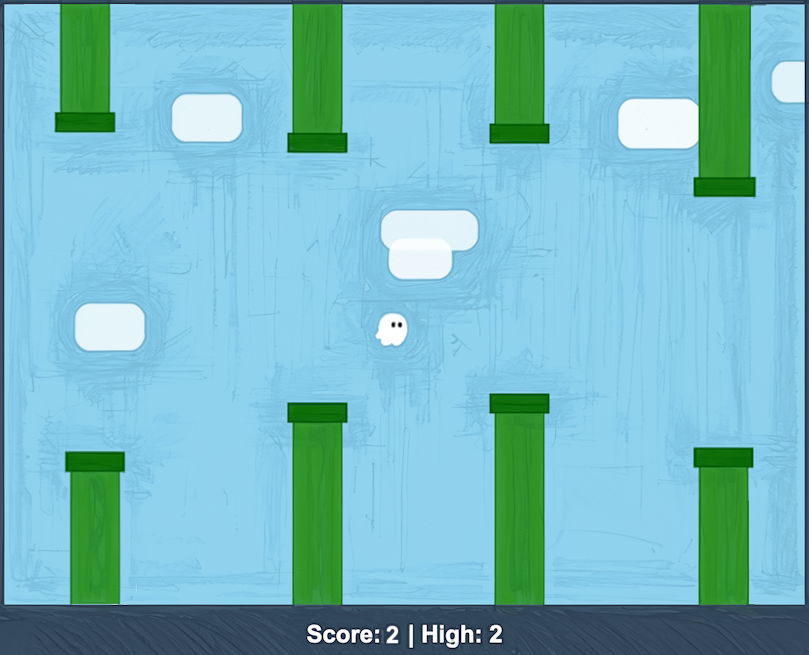

# Flappy Kiro

A retro arcade game built with vanilla HTML, CSS, and JavaScript. Guide Ghosty the ghost through endless pipes and beat your high score!

🎮 **[Play Now](https://elizarrrr.github.io/flappy-kiro-game/)**

## Example UI


## How to Play

- **Press Space**, **click**, or **tap** to make Ghosty flap
- Navigate through the gaps in the pipes
- Each pipe you pass scores one point
- Your high score is saved automatically

## Features

- Smooth physics with gravity and rotation
- Parallax cloud layers for depth
- Particle trail behind Ghosty
- Screen shake on collision
- Score popups when passing pipes
- Persistent high score via localStorage
- Sound effects for flap, score, and game over

## Run Locally

No installation needed. Just serve the files with any local server:

```bash
# Python
python -m http.server 8080

# Node.js
npx serve .
```

Then open `http://localhost:8080` in your browser.

> **Note:** Opening `index.html` directly via `file:///` will not work due to browser audio restrictions.

## Project Structure

```
kiro-introduction/
├── index.html          # Game (single file — all CSS and JS inline)
├── game-logic.js       # Pure game functions (physics, collision, scoring)
├── assets/
│   ├── ghosty.png      # Ghost character sprite
│   ├── jump.wav        # Flap sound effect
│   └── game_over.wav   # Collision sound effect
└── img/
    └── example-ui.png  # Screenshot
```

## Built With

- Vanilla HTML5, CSS, and JavaScript
- HTML5 Canvas for rendering
- Web Audio API for sound effects
- [Kiro](https://kiro.dev) — AI-powered IDE used to spec, design, and build the game

## Resources

- `assets/` — Game audio and sprites
- `img/` — Screenshots and images
